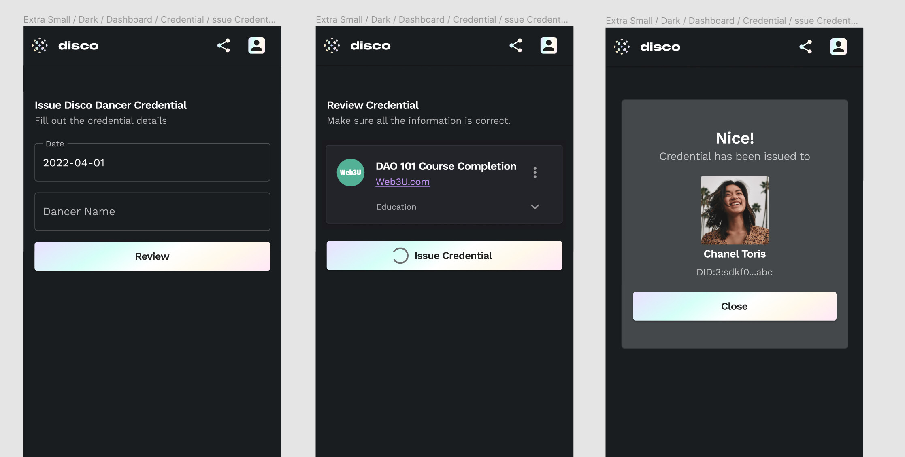

# Disco UI Take-Home Exercise

## Introduction

This exercise will be to 1) implement an "issue credential" flow combining some pre-made components, and 2) create a reusable "success" component for that flow.

We hope you can spend roughly 2 hours on this exercise. Please do not spend more! If you end up needing more time, please stop working and document any extra work you would do to complete it. An incomplete submission is okay; the only requirement is that Storybook runs and that the component loads without error.

We are looking for a submission that is clear, readable, and maintainable. It need not be pixel-perfect, though you are free to play with the design.

Why a take-home assignment? We want something that reflects how engineers work in practice, without the pressure of live coding, and with the freedom to look things up, take a break, or rewrite parts.

## This Repo

Please fork this repo, and then to begin simply run:

```bash
yarn install
yarn storybook
```

Once it has completed, Storybook will load in your browser. Please click around to have a look at existing components. Storybook will live reload as you make changes.

This exercise concerns issuing "Verifiable Credentials" (VCs). These are digital documents issued by one entity's Decentralized Identifier (DID) about another. This could be a driver's license, covid pass, university diploma, etc. In this exercise, the credential will be a simple "kudos" that one user is sending to another user to appreciate them for something.

Components that have already been implemented that you will be using in this exercise are:

- [`Credential`](src/components/credentials/Credential.tsx) - this receives a credential object and displays it. You can see example usage of this component in [`Credential.stories.tsx`](src/components/credentials/Credential.stories.tsx)
- [`IssueCredentialForm`](src/components/credentials/IssueCredentialForm.tsx) - this is a controlled component that receives a credential object, displays form fields to edit it, and sends updates to its parent component via `props.onChange`. Example usage in [`IssueCredentialForm.stories.tsx`](src/components/credentials/IssueCredentialForm.stories.tsx)
- Feel free to use any of the other components in this repo, all of which have Storybook files (`*.stories.tsx`) demonstrating their usage

Please let us know if there are any technical issues with the assignment (e.g. build or environment issues). This repo was built and tested with Node v16.14.0 and Yarn v1.22.18

## Instructions

The goal of this exercise is to implement an "issue credential" flow using pre-built components, and also create a success component for that flow.

Here is an example of this flow (note that it doesn't have to look exactly like this, this is simply representative of the UX):



### Issue Credential flow

Please implement the [`IssueCredentialFlow`](src/components/credentials/IssueCredentialFlow.tsx) component guideing the user through 3 steps:

1. **Edit** - in which the user fills out the [`IssueCredentialForm`](src/components/credentials/IssueCredentialForm.tsx)
2. **Review** - in which the user sees the [`Credential`](src/components/credentials/Credential.tsx) component showing a preview of their credential before issuing it
3. **Success** - in which the user sees a success message using the [`Success`](src/components/Success.tsx) component and values in the `recipient` prop passed to `IssueCredentialFlow`

The [`IssueCredentialFlow`](src/components/credentials/IssueCredentialFlow.tsx) component currently has a stub version of step #1, with some comments marked with `@NOTE` about components and helpers you will be using.

### Success component

Step #3 should involve the reusable [`Success`](src/components/Success.tsx) component that you may architect as you see fit, and that might include props such as `headerText`, `onClose()`, etc.

Please consider how you might make the Success step more exciting for the user, and, if you have time, implement any design ideas you have. Again, the wireframes above are just representative of what you might do.

## Submission

Please fork this repo, commit your implementation, and email us a link at careers@disco.xyz. Feel free to include any notes for us about assumptions or decisions you made, and we also welcome any feedback about this exercise!

## Notes

- Your result need not be pixel perfect at all - concept and functionality are what matters
- We are using Material UI. Feel free to use any of their [components](https://mui.com/components/), simply add the component to the `"@mui/material"` import at the top of the file.
  - MUI components can be styled using the `sx` prop with camelCased CSS properties - search "sx" in [`Credential.tsx`](src/components/credentials/Credential.tsx) for examples
  - They can alternately be styled using `"@mui/material/styles"` - see [`DiscoBox.tsx`](src/components/DiscoBox.tsx) for an example
- Feel free to tweak any components as needed or create new ones, but it is possible to complete the assignment with only code in [`IssueCredentialFlow.tsx`](src/components/credentials/IssueCredentialFlow.tsx) and [`Success.tsx`](src/components/Success.tsx)
- The codebase is in TypeScript, which should be perfectly readable even without any experience in TS. You are welcome however to write your code in JS. To do so, please check out the `javascript` branch of this repo, in which you will find JSX versions of the components you will be editing (`IssueCredentialFlow.jsx` and `Success.jsx`)
- Feel free to ask any clarifying questions about the assignment. However, you have total leeway in how you wish to implement this, and can make arbitrary decisions and assumptions. If you do, note them down and let us know!
